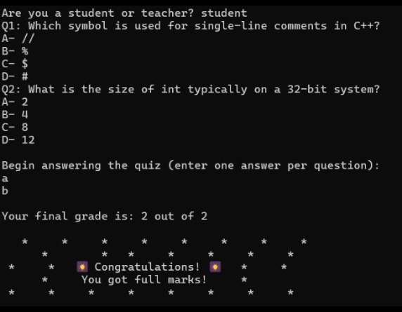

# Simple Quiz System

## Overview
This is a simple C++ quiz program designed for teachers and students. It allows teachers to create multiple-choice quizzes and students to take them. The program evaluates the answers, calculates the score, and displays a text-based fireworks celebration for perfect scores.

[]

## Features
- Teacher mode:
  - Create a quiz by entering questions and four possible answers.
  - Save the quiz and correct answers to files.
- Student mode:
  - Read and answer the quiz from files.
  - Get a final score based on correct answers.
  - Celebrate full marks with a fun fireworks display.

## Files
- `Quiz.txt` – Stores the quiz questions and options.
- `model_answer.txt` – Stores the correct answers.
- `number_of_questions.txt` – Stores the number of questions in the quiz.

## Authors
- Mina Adel – 2022/05319  
- Mina Atef – 2022/05542  
- Youssef Hussein – 2022/02811

## Learning Outcomes
This project was my first programming assignment in an Introduction to Computer Science course. It helped me practice:
- File handling in C++
- Arrays and loops
- Functions and conditional statements
- Basic user interaction
